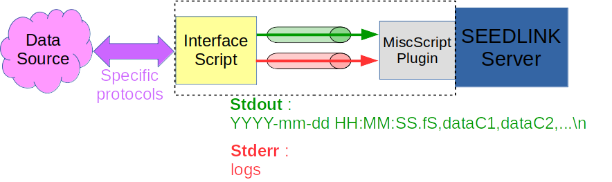
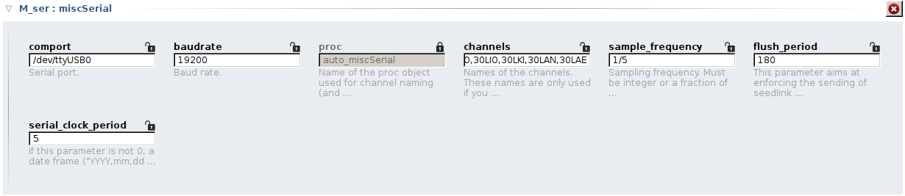
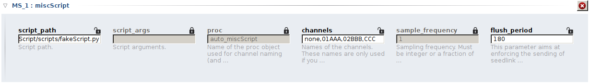

# SeedlinkMiscPlugins
ASCII based Plugins for an easier integration of slow data in Seedlink

[A) Presentation : MiscSerial and miscScript, two generalist SeedLink plugins for easy integration of slow data in Seiscomp3](README.md#a-presentation--miscserial-and-miscscript-two-generalist-seedlink-plugins-for-easy-integration-of-slow-data-in-seiscomp3)    
 
- [A.1) Seiscomp3 and SeedLink](README.md#a1-seiscomp3-and-seedlink)  
- [A.2) miscSerial and miscScript : ASCII based plugins](README.md#a2-miscserial-and-miscscript--ascii-based-plugins)

[B) Compile serial_plugin with embedded miscScript/miscSerial](README.md#b-compile-serial_plugin-with-embedded-miscscriptmiscserial)  

- [B.1) Prepare compilation](README.md#b1-prepare-compilation)      
- [B.2) Copy miscScript/miscSerial sources to seiscomp3 sources tree](README.md#b2-copy-miscscriptmiscserial-sources-to-seiscomp3-sources-tree)    
- [B.3) Compile serial_plugin with miscScript and miscSerial embedded](README.md#b3-compile-serial_plugin-with-miscscript-and-miscserial-embedded)    

[C) Deploy your “new” serial_plugin to an already installed Seiscomp3](README.md#c-deploy-your-new-serial_plugin-to-an-already-installed-seiscomp3)      

[D) How to configure your plugins](README.md#d-how-to-configure-your-plugins)    

- [D.1) How to configure miscSerial plugin](README.md#d1-how-to-configure-miscserial-plugin)    
- [D.2) How to configure miscScript plugin](README.md#d2-how-to-configure-miscscript-plugin)    

[E) Testing Examples](README.md#e-testing-examples)  

- [E.1) MiscScript](README.md#e1-miscscript)  
- [E.2) MiscSerial](README.md#e2-miscserial)

# A) Presentation : MiscSerial and miscScript, two generalist SeedLink plugins for easy integration of slow data in Seiscomp3

## A.1) Seiscomp3 and SeedLink

*"SeisComP is likely the most widely distributed software package for
seismological data acquisition and real-time data exchange over the
Internet. Its data transmission protocol SeedLink became a de facto
world standard."*

*(Quotation from [https://docs.gempa.de/seiscomp3/current/base/introduction.html](https://docs.gempa.de/seiscomp3/current/base/introduction.html))*

This Open-source software package integrates modules for displaying,
archiving, processing (manually and automatically), sharing data and
metadata, and more...

SEED format and associated SeedLink protocol have primarily been defined
for seismic data. But in fact, it can be used for all kind of constant
rate data series from a spatially fixed measurement station.

To make the integration in seedlink of new slow rate data easier, two
Seedlink plugins, named miscScript and miscSerial, have been developed.

## A.2) miscSerial and miscScript : ASCII based plugins 

The aim of these two plugins is to process a flow of ASCII data frame.
The first one, MiscSerial, get these frames from serial port. The second
one, MiscScript, uses a script as front end. This script is in charge of
collecting data and formatting them within the expected format.

The format of the frames expected by miscScript and miscSerial is :

*YYYY-mm-dd HH:MM:SS.ms, dataC1,dataC2,dataC3,...\\n*

It is just comma separated fieds:

-   The first field is the date/time : *"YYYY-mm-dd HH:MM:SS.fs"*. Note
    that fs is one or more digits representing a decimal fraction of a
    second. fs is optional.
    In order to be more ISO 8601 compatible, it is possible to use an other character than space as separator between dd and HH. It is also accepted to have extra characters at the end of the date. So for example *2020-04-22T06:00:00Z* is also valid.
    
-   The next fields are ASCII written integers between -2147483648 and
    2147483647 (4 bytes signed integers). Each field represents one
    channel. It is allowed to let one or several fields empty in case of
    missing data.
-   A frame is terminated with a line feed character ("\\n")

These frames are expected to come in with constant rate. This rate is configurable.

NB : These plugins are in fact not independent plugins. They are just additional "protos" embedded into serial\_plugin.

### MiscSerial

In the case of MiscSerial, the frames flow is collected through a serial
port.

It is also possible to output a clock frame ("YYYY-mm-dd HH:MM:SS\\n")
onto serial port in order to trigger or synchronize the source. The rate
of emitted clock frame is configurable.

This plugin is for example useful with programmable data-loggers which
allow you to output formatted frames on a serial port.

### MiscScript

MiscScript is more flexible. To use it, you first need to write a script
which interface with your data source. This script has to output the
formatted frames on its standard output with a constant rate.

The standard error stream is used for error logs. These logs are written
by the plugin in seedlink.log with a warning level.

In case of crash of the script, the plugin restarts and relaunches a script
instance.

This plugin is really flexible and can so be used with lots of different
data sources and protocole (i2c, spi, serial, ...). You just have to
first write the interface script.

# B) Compile serial_plugin with embedded miscScript/miscSerial

## B.1) Prepare compilation

We assume here that you have already a seiscomp3 compilation chain ready on your computer : <https://github.com/SeisComP3/seiscomp3>

## B.2) Copy miscScript/miscSerial sources to seiscomp3 sources tree

In the rest of this document, we will name "$SC3_SRC" the seiscomp3 source folder path, and "$SMP" the seedlinkMiscPlugins folder path.

	$ cd $SMP/src  
	$ cp ./* $SC3_SRC/src/seedlink/plugins/serial_plugin

## B.3) Compile serial_plugin with miscScript and miscSerial embedded

	$ cd $SC3_SRC/build
	$ make serial_plugin

Once compilation is finished, check if the resulting binary embed correctly miscScript and miscSerial :

	$ cd bin
	$ ./serial\_plugin -m

should now return :

    SeedLink Serial Digitizer Plugin v2.2 (2019.210)

	Supported protocols: miscScript, miscSerial, modbus, ws2300,
	solar, sadc, prema,mws, hrd24, guralp2, edata_r, edata, dr24

# C) Deploy your "new" serial_plugin to an already installed Seiscomp3

In the rest of this document, we will name "$SC3_INST" the already installed seiscomp3 folder path.

- Replace serial_plugin binary : 

      $ cd $SC3_INST/share/plugins/seedlink/  
      $ mv serial_plugin serial_pluginORIG  
      $ cp $SC3_SRC/build/bin/serial_plugin .

- Deploy other needed files from $SMP/others :

      $ cd $SMP/others
      $ mv $SC3_INST/etc/init/seedlink.py $SC3_INST/etc/init/seedlink.pyORIG    
      $ cp seedlink.py $SC3_INST/etc/init
      $ cp seedlink_miscScript.xml seedlink_miscSerial.xml $SC3_INST/etc/descriptions  
      $ cp -r miscScript miscSerial $SC3_INST/share/templates/seedlink

-   You can now open scconfig and use miscScript and miscSerial in
    seedlink profiles.

# D) How to configure your plugins

Here is explained how to configure miscSerial and miscScript plugins in
scconfig. Once you have finished to bind and to configure your plugins,
do not forget to save, to "update-config" seedlink and to "restart" it.

## D.1) How to configure miscSerial plugin

-   **comPort** : Serial Port selection
-   **baudrate** : Speed of the serial port
-   **proc** : Name of the proc object used for channel naming (and
    eventually down sampling). If this field is left to default
    (auto_miscSerial), a basic proc (without decimation) will be
    automatically generated from the channels' names list (see below).
-   **channels** : comma separated list of channels' names. These names
    are used only if you choose to automatically generate the proc (proc
    auto_miscSerial). Nevertheless, even if you are not using the auto
    proc, it is important to declare correctly this list as the number
    of channels is used to size the internal plugin's buffers. So if
    your data ASCII frames are composed of X fields after the timing
    field, please check that your channel's names list is also composed
    of X items.

    -   A channel name can be a standard 3 characters names as described
        in appendix A of the SEED manual. Ex: HHZ
    -   You can optionnally add a two digit location code. Ex : 01HHZ
    -   If you do not want the channel to be used by your seedlink
        server, just replace its name by "none".  
          
    Namming list exemple : LHZ,LHE,LHN,none,01LHZ,02LHZ

-   **sample_frequency** (Hz) : Sampling frequency. Must be written as an
    integer or a fraction of integers (ex : 1/10). Must be the same as
    the source output data rate.
-   **flush_period** (s) : This parameter aims at enforcing the sending of
    seedlink data blocks (512bytes), even if they are not yet full. 0
    means no enforcing.
-   **serial\_clock\_period** (s) : If this parameter is not 0, a date frame ("YYYY-mm-dd hh:mm:ss\\n") will be send on serial port every
    serial\_clock\_period seconds. It can be used to trigger or
    synchronize the data source.

## D.2) How to configure miscScript plugin

-   **Script_path** : path of the interface script (or executable binary)
-   **Script_args** : arguments of the script (depends on your script). Can
    be left empty.
-   **Proc** : cf. "How to configure miscSerial plugin"
-   **channels** : cf. "How to configure miscSerial plugin"
-   **sample_frequency** : Sampling frequency. Must be written as an
    integer or a fraction of integers (ex : 1/10). Must be the same as
    the script output data rate.
-   **flush_period** : cf. "How to configure miscSerial plugin"

# E) Testing Examples

## E.1) MiscScript

For testing purposes, a simple script outputting (on stdout) “fake” ASCII frames at constant rate is provided : *$SC3_INST/share/templates/seedlink/miscScript/scripts/fakeScript.py*

## E.2) MiscSerial

For testing purposes, a simple script outputting (on serial\_port)“fake” ASCII frames at constant rate  is provided : *$SC3\_INST/share/templates/seedlink/miscSerial/scripts/fake_miscSerial.py*

This script needs pyserial library to work ( https://github.com/pyserial/pyserial).

You can also use socat to set virtual serial ports.
